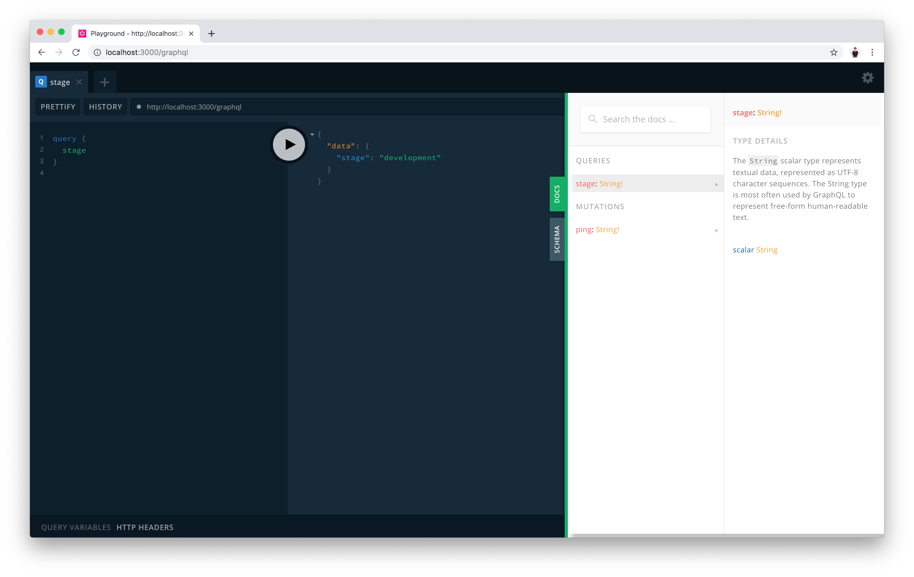

# 1. GraphQL 살펴보기
### 본 챕터의 학습 목표는 아래와 같습니다. 👏
- [ ] GraphQL 이해하기
- [ ] Node.js 환경에서 GraphQL 프로젝트 시작하기
- [ ] `Schema-First` vs. `Code-First` 개념에 대해 이해하기
- [ ] Nexus 문법 익히기

## (1) GraphQL이란?
GraphQL은 API 설계(Schema)와 요청(Query)을 구조화하는 일련의 약속(Interface)입니다. GraphQL을 통해서 우리는 데이터에 기반하여 API를 디자인 할 수 있으며, 클라이언트에서는 정해진 쿼리 언어를 통해 API를 체계적으로 사용 할 수 있습니다.
- 클라이언트는 서버에 필요한 자원만 요청 할 수 있습니다.
- 클라이언트는 서버가 가진 많은 자원을 단 한 번의 요청으로 가져 올 수 있습니다.
- 타입 시스템을 통해 개발 생산성을 비약적으로 향상 시킬 수 있습니다.
- 제공되는 기본 개발자 도구를 통해 API를 쉽게 문서화하고 검색 할 수 있습니다.
- 버전 관리 없이 API를 점진적으로 진화 시킬 수 있습니다.

## (2) GraphQL 타입 시스템과 쿼리, 뮤테이션 타입
GraphQL의 기본 타입에는 다음 5가지가 존재합니다.

- `Int`: 부호가 있는 32비트 정수.
- `Float`: 부호가 있는 부동소수점 값.
- `String`: UTF-8 문자열.
- `Boolean`: `true` 또는 `false`.
- `ID`: `ID` 스칼라 타입은 객체를 다시 요청하거나 캐시의 키로써 자주 사용되는 고유 식별자를 나타냅니다. `ID` 타입은 String 과 같은 방법으로 직렬화되지만, `ID`로 정의하는 것은 사람이 읽을 수 있도록 하는 의도가 아니라는 것을 의미합니다.

#### 예제

`User`와 `Post`라는 타입을 스키마에 선언해볼까요?

```graphql
type User {
  id: ID!
  username: String!
  posts: [Post!]!
}

type Post {
  id: ID!
  title: String!
  content: String!
  author: User!
}
```

> 참고: `!`는 데이터 값에 `null`이 포함 될 수 없음을 나타냅니다. 기본적으로 `!`는 모두 붙여준다고 생각하는 것이 좋습니다.

API 설계 단에서 다음과 같이 API에 필요한 타입들을 정의 할 수 있습니다. 자 이제 타입을 만들었으니, 해당 타입을 가지는 데이터를 가져올 수 있도록 만들어주어야겠죠?

### 쿼리와 뮤테이션
쿼리와 뮤테이션은 기본적으로 선언되어야 하는 타입입니다.

- 쿼리는 데이터를 가져오는데 사용합니다. 
  - `ID` 속성을 통해 Client 내부에서 Cache를 구현 할 수 있습니다
- 뮤테이션은 데이터를 조작하는데 사용합니다.
  - 생성
  - 수정
  - 삭제
  - ...

이 두가지 타입을 통해 데이터를 가져오고, 수정 할 수 있도록 `Query`, `Mutation` 타입 내에 속성들을 선언해보겠습니다.

#### 예제
```graphql
type User {
  id: ID!
  username: String!
  posts: [Post!]!
}

type Post {
  id: ID!
  title: String!
  content: String!
  author: User!
}

type Query {
  user(id: ID!): User!
  post(id: ID!): Post!
}

type Mutation {
  createUser(username: String!): User!
  updateUser(id: ID!, username: String): User!
  deleteUser(id: ID!): User!
  createPost(title: String!, content: String!, authorId: String!): Post!
  updatePost(id: ID!, title: String, content: String): Post!
  deletePost(id: ID!): Post!
}
```

다음과 같이 `Query`와 `Mutation`에 속성 값으로 필요한 쿼리, 뮤테이션 들을 만들어주었습니다.

### 리졸버
이렇게 멋지게 선언해 준 GraphQL 스키마를 어떻게 구동시킬 수 있을까요? 바로 리졸버가 그 역할을 해줍니다. 리졸버는 타입 내 속성과 1:1로 일치시켜 구현이 필요합니다. 리졸버는 `parent`, `args`를 기본 argument로 하는 함수의 형태입니다.

- `parent`는 상위 리졸버에서 `return` 한 값을 나타냅니다
- `args`는 쿼리문 내에서 넣어준 매개변수를 나타냅니다.
- `context`는 요청 하나를 타고 공유되는 전역 상태입니다. (로그인 세션 정보등을 저장)

#### 예제
```typescript
const User = {
  id: (parent, args, context) => {
    return parent.id
  },
  username: (parent, args, context) => {
    return parent.username
  },
  posts: (parent, args, context) => {
    const userId = parent.id
    const posts = db.table('Post').filter((post) => post.authorId === userId)

    return posts
  },
}

const Post = {
  id: (parent, args, context) => {
    return parent.id
  },
  title: (parent, args, context) => {
    return parent.title
  },
  content: (parent, args, context) => {
    return parent.content
  },
  author: (parent, args, context) => {
    const authorId = parent.authorId
    const user = db.table('User').findOne((user) => user.id === authorId)

    if (user) {
      return user

    } else {
      throw new Error('Author is not found')
    }
  },
}

const Query = {
  user: (parent, args, context) => {
    const userId = args.id
    const user = db.table('User').findOne((user) => user.id === userId)

    if (user) {
      return user

    } else {
      throw new Error('User is not found')
    }
  },
  post: (parent, args, context) => {
    const postId = args.id
    const post = db.table('Post').findOne((post) => post.id === postId)

    if (post) {
      return post

    } else {
      throw new Error('User is not found')
    }
  },
}

const Mutation = {
  createUser: (parent, args, context) => {
    /* 새 유저를 생성해서 데이터베이스에 삽입합니다 */
    return user
  },
  updateUser: (parent, args, context) => {
    /* args.id를 통해 데이터베이스에서 기존 유저를 불러와 값을 수정 한 뒤 데이터베이스에 삽입합니다 */
    return user
  },
  deleteUser: (parent, args, context) => {
    /* args.id를 통해 데이터베이스에서 기존 유저를 삭제합니다 */
    return user
  },
  createPost: (parent, args, context) => {
    /* 새 게시물을 생성해서 데이터베이스에 삽입합니다 */
    return post
  },
  updatePost: (parent, args, context) => {
    /* args.id를 통해 데이터베이스에서 기존 게시물을 불러와 값을 수정 한 뒤 데이터베이스에 삽입합니다 */
    return post
  },
  deletePost: (parent, args, context) => {
    /* args.id를 통해 데이터베이스에서 기존 게시물을 삭제합니다 */
    return post
  },
}
```
> 본 예제 코드에는 이해를 위한 가상의 `db` 변수를 사용했습니다. (실제 동작하지 않은 Pseudo 코드입니다)

### 요청
클라이언트가 다음과 같은 문법으로 서버에 요청을 날릴 수 있습니다.

```graphql
query {
  user(id: "ea9f5eac-1449-5f03-a1c9-6521622de815") {
    id
    username
  }
}
```

이 요청에 응답하기 위해 서버에서
1. `Query.user` 리졸버가 실행됩니다.
2. 데이터베이스에서 User를 가져와서 해당 값을 리졸버 함수 내에서 `return` 합니다
3. `return` 값을 `User.id`, `User.username` 리졸버에 `parent` argument로 넘겨줍니다
    1. `User.id` 리졸버는 `parent`값을 사용해, id 값을 `return` 합니다.
    2. `User.username` 리졸버는 `parent`값을 사용해, username 값을 `return` 합니다.

순으로 리졸버가 실행됩니다. 그 후 결과를 종합해 다음과 같이 JSON으로 응답하여 줍니다.
```json
{
  "user": {
    "id": "ea9f5eac-1449-5f03-a1c9-6521622de815",
    "username": "tonyfromundefined"
  }
}
```

이러한 개발 방식을 GraphQL에서 *Schema-First (SDL-First)* 개발 방식이라고 합니다. 이러한 방식은 처음 GraphQL 구현체가 등장했을 때 많이 사용되었습니다.

하지만, *Schema-First* 개발 방식에는 다음과 같은 한계점이 존재합니다.

1. 스키마 정의와 리졸버 간의 불일치 문제
2. GraphQL 스키마 분리 문제
3. 스키마 정의의 중복 (코드 재사용 문제)
4. IDE 지원 부족으로 인한 낮은 개발 경험
5. Schema 작성 문제

따라서, 이러한 한계점을 효과적으로 해결하기 위해 *Code-First* 개발 방식이 등장하게 되었습니다.

> 참고: [The Problems of "Schema-First" GraphQL Server Development](https://www.prisma.io/blog/the-problems-of-schema-first-graphql-development-x1mn4cb0tyl3)

## (3) Nexus로 시작하는 *Code-First* GraphQL 개발
GraphQL에 대해 이해하셨나요? 앞서 말씀드린 Code-First 개발 방법에 대한 구현체로 Nexus라는 오픈소스 라이브러리를 Prisma에서 내놓았습니다.

이 챕터에서는

- Node.js
- TypeScript
- Webpack
- Nexus

를 기반으로 하는 실제 GraphQL 프로젝트를 살펴보겠습니다. 해당 프로젝트는 본 레포 안의 `/starters/server` 폴더 안에서 찾을 수 있습니다.

### 폴더 및 파일 구조 살펴보기
#### `/`
- `.env.example`
  - 환경변수 설정 파일입니다.
  - `.env.example`를 참고하여 폴더 내에 `.env.development`와 `.env.production`을 만들어줍니다.
- `package.json`, `yarn.lock`
  - 현재 프로젝트가 의존하고 있는 라이브러리와 버전 정보를 담고 있습니다
  - `yarn` 명령어를 통해 라이브러리를 모두 설치 할 수 있습니다.
- `tsconfig.json
  - TypeScript 관련 설정 파일입니다.
- `tslint.json`
  - TSLint 관련 설정 파일입니다.
- `webpack.config.dev.js`
  - 개발 모드의 Webpack 빌드 설정입니다.
  - `yarn dev` 명령에서 해당 설정으로 Webpack이 작동합니다.
- `webpack.config.prod.js`
  - Production 모드의 Webpack 빌드 설정입니다.
  - `yarn build` 명령에서 해당 설정으로 Webpack이 작동합니다.
- `serverless.yml`
  - 배포를 위한 Serverless Framework 설정입니다.

#### `/src/`
- `app.ts`
  - Express.js 프레임워크를 통해 API가 구현되는 엔트리 파일입니다. 만들어진 API 서버를 export 합니다.
- `server.ts`
  - `app.ts`에서 API 서버를 가져와 3000 포트로 Listen합니다.
  - 개발 서버를 띄우는 데 사용합니다.
- `serverless.ts`
  - `app.ts`에서 API 서버를 가져와 `aws-serverless-express`를 사용하여, Lambda 요청에 응답하는 함수를 초기화합니다.
  - API Gateway와 Lambda 기반의 서버리스 환경에 배포 할 때 사용합니다.

#### `/src/schema/`
- `index.ts`
  - 엔트리 파일입니다. `Query.ts`와 `Mutation.ts`가 내보낸 항목을 다시 내보내는 역할을 합니다.
- `Query.ts`
  - 기본 Query 타입을 선언합니다.
- `Mutation.ts`
  - 기본 Mutation 타입을 선언합니다.

#### `/src/generated`
- `schema.graphql`
  - Nexus가 자동 생성한 Schema 입니다.
- `typegen.ts`
  - Nexus가 자동 생성한 TypeScript Typing 입니다.


### 시작하기
- `/starters/server/` 폴더로 이동합니다.

  ```bash
  $ cd ./starters/server
  ```

- 프로젝트에 필요한 라이브러리를 설치합니다.

  ```bash
  # 기존에 yarn이 설치되어 있지 않다면,
  $ npm i -g yarn

  # 라이브러리 설치하기
  $ yarn
  ```

  > 해당 작업이 완료되면 `node_modules` 폴더가 생성되고 해당 폴더 아래에 필요한 라이브러리들이 위치하게 됩니다.

- 프로젝트 폴더에 아래 두 파일을 생성합니다.
  - `.env.development`
    
    ```
    STAGE = "development"
    IS_PLAYGROUND_ENABLED = "1"
    ```
  
  - `.env.production`
    
    ```
    STAGE = "production"
    IS_PLAYGROUND_ENABLED = "0"
    ```

  > 두 파일을 통해 각 스테이지에서 환경 변수를 설정 할 수 있습니다.

- 개발 서버 시작하기

  ```bash
  $ yarn dev
  ```
  > 개발 서버를 시작 한 뒤에는 `http://localhost:3000`로 접근 할 수 있습니다.

- Nexus 기반으로 작성된 `Query`와 `Mutation` 살펴보기

  #### `/src/schema/Query.ts`
  ```typescript
  import { queryType } from 'nexus'

  export const Query = queryType({
    definition(t) {
      t.string('stage', {
        resolve: (_parent, _args, _context) => {
          return process.env.STAGE as string
        },
      })
    },
  })
  ```

  #### `/src/schema/Mutation.ts`
  ```typescript
  import { mutationType } from 'nexus'

  export const Mutation = mutationType({
    definition(t) {
      t.string('ping', {
        resolve: (_parent, _args, _context) => {
          return 'pong'
        },
      })
    },
  })
  ```

  다음과 같이 Nexus를 통해서 코드를 작성하면, Nexus가 해당 코드를 이용해 `/src/generated/schema.graphql`을 자동으로 생성해줍니다. 따라서, *Schema-First*에서 존재했던 문제점인 **스키마 정의와 리졸버 간의 불일치 문제**와 **Schema 작성 문제**를 해결 할 수 있습니다.

  추가적으로 Nexus가 `/src/generated/typegen.ts`에 TypeScript 타이핑을 자동으로 생성해주기 때문에, GraphQL 타입 환경을 TypeScript 환경과 결합하여 초월적인 개발 편의성을 만끽 할 수 있습니다. (**IDE 지원 부족으로 인한 낮은 개발 경험** 문제 해결)

  #### `/src/generated/schema.graphql`
  ```graphql
  type Query {
    stage: String!
  }

  type Mutation {
    ping: String!
  }
  ```

## (4) GraphQL Playground
API를 작성했다면, 해당 API가 정상적으로 동작하는지 테스트해보아야겠죠? 개발 서버를 띄워놓은 상태에서 `http://localhost:3000/graphql`로 접속하면, GraphQL 문서화 도구인, *GraphQL Playground*를 볼 수 있습니다.



*GraphQL Playground*를 통해,
- GraphQL API를 검색하고 (DOCS 메뉴)
- 구현된 API를 테스트 할 수 있습니다. (좌: Query 작성 및 수행 / 우: 응답 JSON)

자, 그럼 *GraphQL Playground*를 통해 아래 쿼리가 정상적으로 동작하는지 테스트해봅시다.

```graphql
query {
  stage
}
```

```graphql
mutation {
  ping
}
```

## (5) `Task` 타입과 쿼리, 뮤테이션 만들기
자 이제 우리만의 타입을 하나 만들어봅시다. `/src/schema` 폴더 내에 `task` 폴더를 새로 생성해줍니다. 그리고 그 아래

- `/src/schema/task/index.ts` (`Task` 타입 정의 및 Query, Mutation을 받아서 export)
- `/src/schema/task/Query.ts` (`Query` 타입을 확장)
- `/src/schema/task/Mutation.ts` (`Mutation` 타입을 확장)

파일을 생성해줍니다.

각 파일을 작성해볼까요?

#### `/src/schema/task/index.ts`
```typescript
import { objectType } from 'nexus'

interface ITask {
  id: string
  content: string
  isDone: boolean
}

// 가상의 Database
export const TASKS: ITask[] = []

export const Task = objectType({
  name: 'Task',
  definition(t) {
    t.id('id', {
      description: 'Task 생성 시 자동 생성되는 Unique ID',
    })
    t.string('content', {
      description: 'Task 내용',
    })
    t.boolean('isDone', {
      description: 'Task 완료 여부',
    })
  },
})

export * from './Query'
export * from './Mutation'
```

#### `/src/schema/task/Query.ts`
```typescript
import { extendType, idArg } from 'nexus'
import { TASKS } from './'

export const TaskQueries = extendType({
  type: 'Query',
  definition(t) {
    t.field('task', {
      type: 'Task',
      args: {
        id: idArg(),
      },
      resolve: (_parent, args) => {
        const task = TASKS.find((task) => task.id === args.id)

        if (task) {
          return task

        } else {
          throw new Error(`${args.id}를 가진 Task를 찾을 수 없습니다`)
        }
      },
    })

    t.list.field('tasks', {
      type: 'Task',
      resolve: () => {
        return TASKS
      },
    })
  },
})
```

#### `/src/schema/task/Mutation.ts`
```typescript
import { booleanArg, extendType, idArg, stringArg } from 'nexus'
import short from 'short-uuid'
import { TASKS } from './'

export const TaskMutations = extendType({
  type: 'Mutation',
  definition(t) {
    t.field('createTask', {
      type: 'Task',
      args: {
        content: stringArg({
          required: true,
        }),
      },
      resolve: (_parent, args) => {
        const task = {
          id: short.generate(),
          content: args.content,
          isDone: false,
        }

        TASKS.push(task)

        return task
      },
    })

    t.field('updateTask', {
      type: 'Task',
      args: {
        id: idArg({
          required: true,
        }),
        content: stringArg(),
        isDone: booleanArg(),
      },
      resolve: async (_parent, args) => {
        const taskIndex = TASKS.findIndex((task) => task.id === args.id)

        if (taskIndex) {
          if (args.content) {
            TASKS[taskIndex].content = args.content
          }
          if (args.isDone) {
            TASKS[taskIndex].isDone = args.isDone
          }

          return TASKS[taskIndex]

        } else {
          throw new Error(`${args.id}라는 ID를 가진 Task를 찾을 수 없습니다`)
        }
      },
    })

    t.field('deleteTask', {
      type: 'Task',
      args: {
        id: idArg({
          required: true,
        }),
      },
      resolve: async (_parent, args) => {
        const taskIndex = TASKS.findIndex((task) => task.id === args.id)

        if (taskIndex) {
          const task = TASKS[taskIndex]
          TASKS.splice(taskIndex, 1)

          return task

        } else {
          throw new Error(`${args.id}라는 ID를 가진 Task를 찾을 수 없습니다`)
        }
      },
    })
  },
})
```

기존 schema 엔트리 파일을 수정해, Task 엔트리 파일을 내보냅니다.

#### `/src/schema/index.ts`
```typescript
export * from './Query'
export * from './Mutation'

export * from './task'
```

개발 서버를 띄워놓은 상태라면, Nexus가 자동으로 Schema를 생성합니다.😎
```graphql
### This file was autogenerated by GraphQL Nexus
### Do not make changes to this file directly


type Mutation {
  createTask(content: String!): Task!
  deleteTask(id: ID!): Task!
  ping: String!
  updateTask(content: String, id: ID!, isDone: Boolean): Task!
}

type Query {
  stage: String!
  task(id: ID): Task!
  tasks: [Task!]!
}

type Task {
  """Task 내용"""
  content: String!

  """Task 생성 시 자동 생성되는 Unique ID"""
  id: ID!

  """Task 완료 여부"""
  isDone: Boolean!
}
```

만들어진 API를 GraphQL Playground로 테스트 해 볼까요?
```graphql
mutation {
  createTask(content: "Hello, World") {
    id
  }
}
```

```graphql
query {
  tasks {
    id
    content
  }
}
```

다음과 같이 Nexus를 활용하여, 빠르고 안정적으로 GraphQL 개발을 시작 할 수 있습니다.

또한, 기존 *Schema-First* 방식과 다르게 Nexus의 *Code-First* 방식은 TypeScript 기반으로 코드를 자유롭게 분할 할 수 있기 때문에, 앞서 제기된 **GraphQL 스키마 분리 문제** 및 **스키마 정의의 중복 (코드 재사용 문제)** 를 해결 할 수 있습니다.

자, 그럼 이제 우리가 만든 API 서버를 Lambda에 배포해볼까요?

## 학습 목표 확인하기
- [x] GraphQL 이해하기
- [x] Node.js 환경에서 GraphQL 프로젝트 시작하기
- [x] `Schema-First` vs. `Code-First` 개념에 대해 이해하기
- [x] Nexus 문법 익히기

## 다음으로 이동
1. <span style="text-decoration: line-through;">**GraphQL 살펴보기**</span> ✔
    1. <span style="text-decoration: line-through;">GraphQL이란?</span>
    2. <span style="text-decoration: line-through;">GraphQL Type 시스템과 `Query`, `Mutation` Type</span>
    3. <span style="text-decoration: line-through;">Nexus로 시작하는 *Code-First* GraphQL 개발</span>
    4. <span style="text-decoration: line-through;">GraphQL Playground</span>
    5. <span style="text-decoration: line-through;">`Task` 타입과 쿼리, 뮤테이션 만들기</span>
2. **👉 [Serverless로 GraphQL API 배포하기](/documents/2-serverless)**
    1. IAM 사용자 생성하기
    2. Serverless Framework을 사용해 Node.js 프로젝트 배포하기
3. AWS에 Prisma 배포하기 (CloudFormation)
4. Prisma 사용하기
    1. Prisma란?
    2. Prisma 시작하기
    3. Prisma Client 사용해보기
    4. `nexus-prisma`를 사용해, Prisma 연결하기
5. React.js에서 GraphQL 사용하기
6. 삭제하기
    1. API 배포 삭제하기
    2. CloudFormation Stack 삭제하기

---

### References
- [GraphQL 영문 문서](https://graphql.org/)
- [GraphQL 한국어 문서](https://graphql-kr.github.io/learn/schema/#)
