# 2. Serverless로 GraphQL API 배포하기

### 본 챕터의 학습 목표는 아래와 같습니다. 👏
- [ ] IAM에 대해 이해한다
- [ ] API Gateway와 Lambda를 통한 서버리스 API 배포에 대해 이해한다
- [ ] `aws-serverless-express`를 사용해, Node.js 앱을 Lambda에 배포한다


## (1) IAM 사용자 생성하기
AWS 계정 내 자원들을 내 컴퓨터에서 사용하기 위해서는 권한 관련 설정을 컴퓨터에 주입하여야 합니다. 권한들을 담는 그릇에는 사용자와 역할 두 가지가 있는데, 그 중에 우리는 새 사용자를 생성하여 해당 사용자를 AWS CLI를 통해 컴퓨터에 주입해주도록 합니다.

- [AWS Console](https://console.aws.amazon.com)에 로그인 후 `Find Services`에서 `IAM`을 검색, 클릭합니다


- IAM 콘솔에 들어왔다면, `Users` 메뉴로 이동, `Add user` 버튼을 클릭합니다
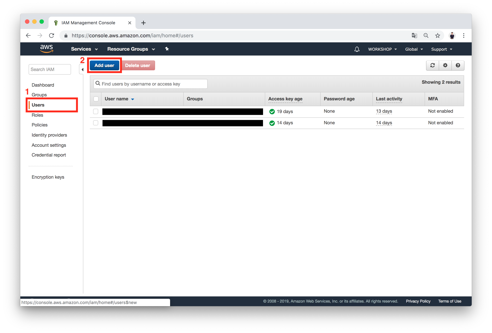

- `User name*`에 `SERVERLESS_WORKSHOP`을 적어준 뒤 `Programmatic access`에 체크해줍니다.
- `Next: Permissions` 버튼을 클릭합니다.
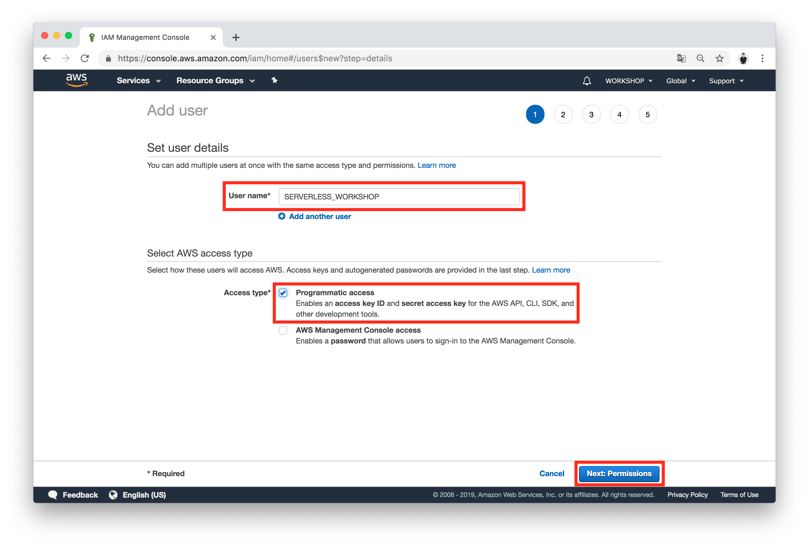

- `Next: Tags` 버튼을 클릭합니다.
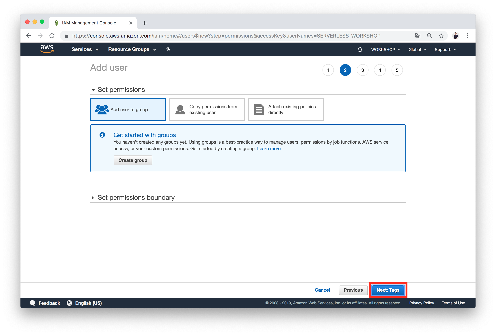

- `Next: Review` 버튼을 클릭합니다.
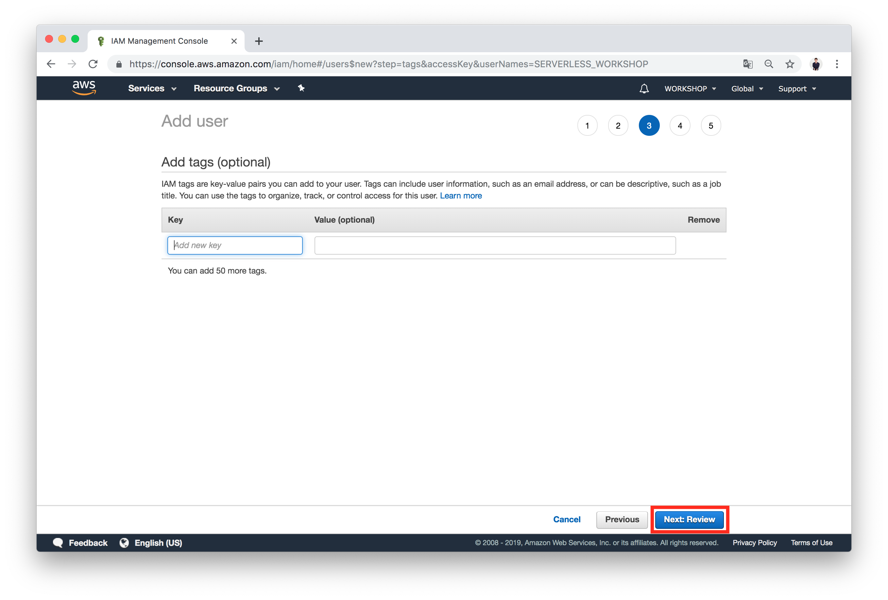

- `Create user` 버튼을 클릭합니다.
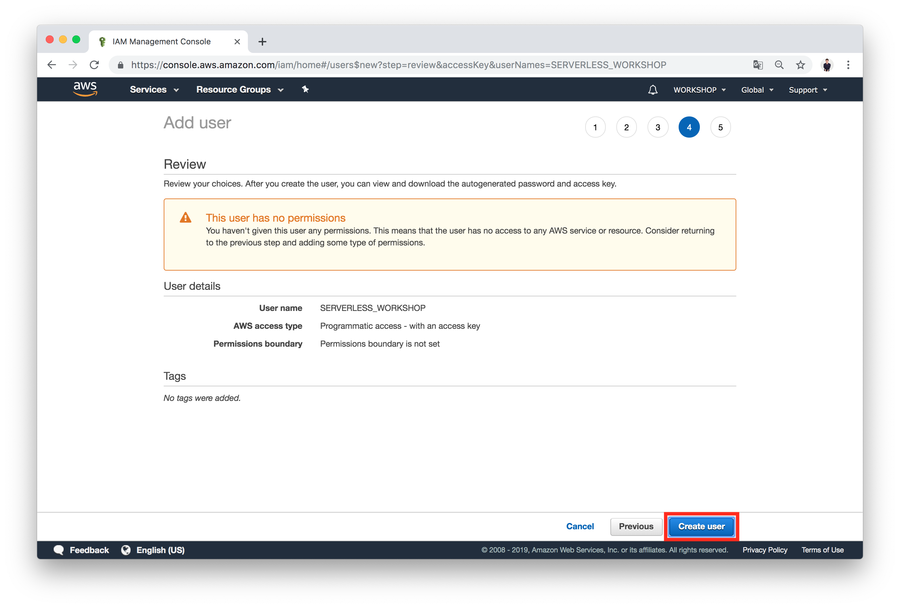

- `Access key ID`와 `Secret access key`를 **안전한** 로컬 메모장에 복사해 붙여넣어 둡니다. (이 창을 떠나면 다시 확인 할 수 없습니다)
  > 해커들은 비트코인 채굴을 위해 Access Key ID와 Secret access key를 24시간 호시탐탐 노리고 있습니다. 코드 내 삽입하여 GitHub 등 코드 저장소에 업로드 할 경우, 수천~수만달러 과금이 될 수 있습니다.
- `Close` 버튼을 클릭합니다.
  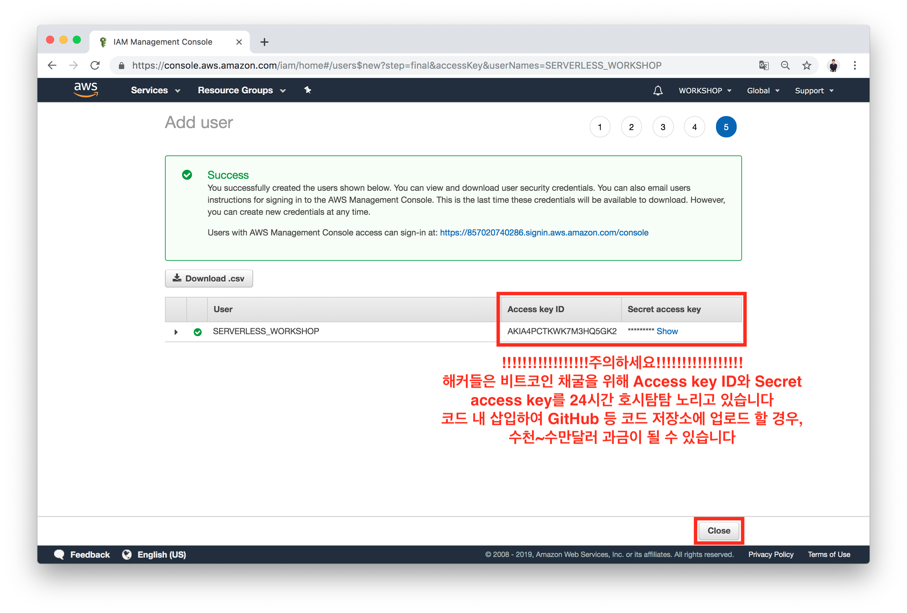

- 사용자 목록 창으로 돌아오면, 바로 생성한 `SERVERLESS_WORKSHOP`을 클릭합니다.
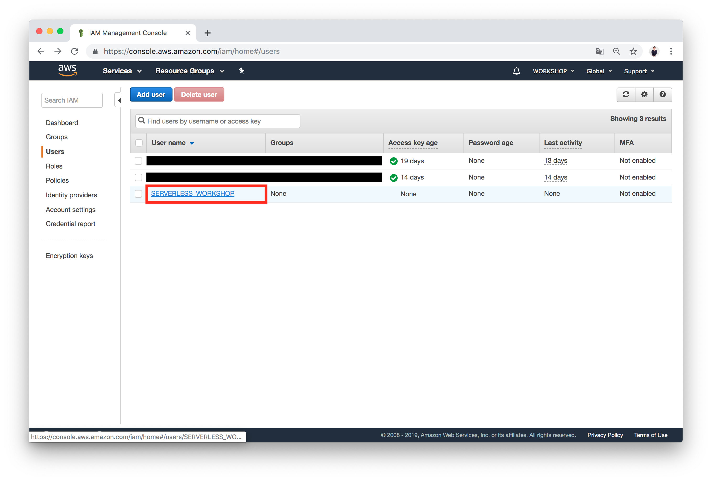

- `Add inline policy`를 클릭합니다.
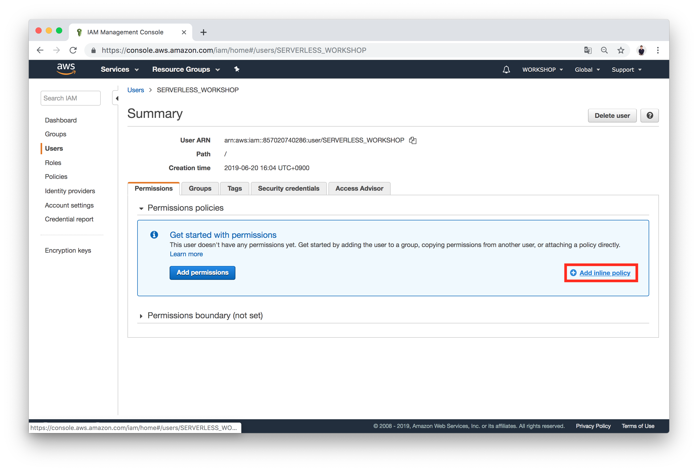

- `JSON` 탭으로 이동합니다
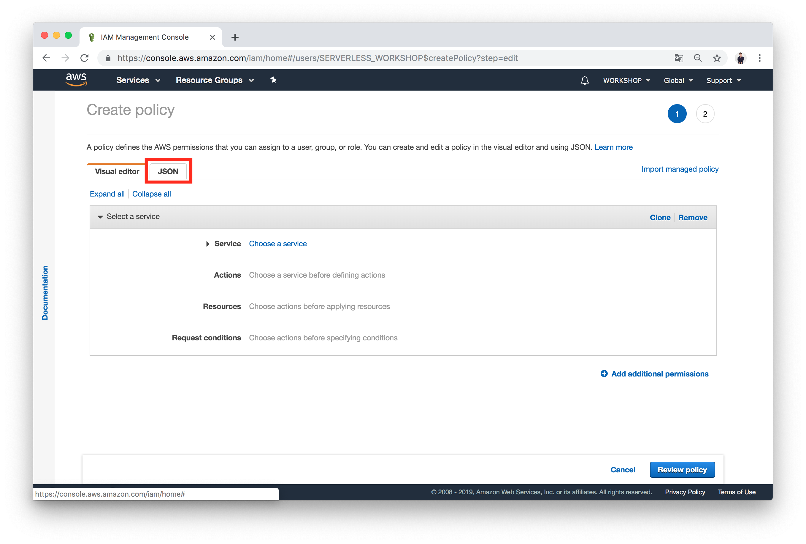

- `JSON` 탭으로 이동 한 뒤, 아래 내용을 콘솔 내 에디터에 붙여 넣습니다.

  ```json
  {
    "Version": "2012-10-17",
    "Statement": [
      {
        "Sid": "VisualEditor0",
        "Effect": "Allow",
        "Action": [
          "iam:*",
          "apigateway:*",
          "s3:*",
          "logs:*",
          "lambda:*",
          "cloudformation:*"
        ],
        "Resource": "*"
      }
    ]
  }
  ```

- `Review policy`를 클릭합니다
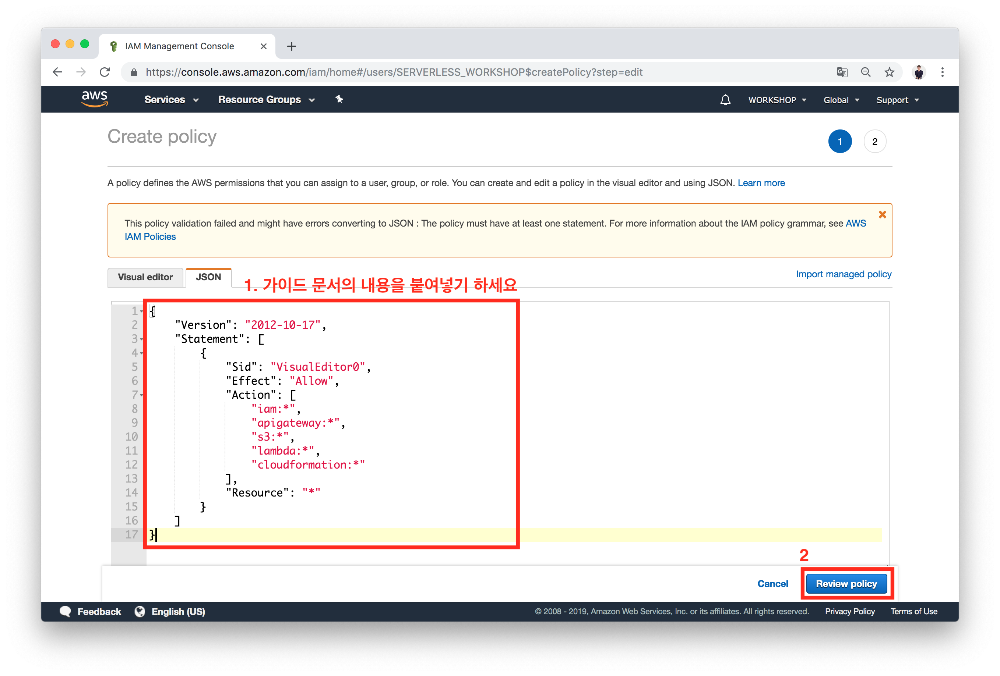

- `Name*` 항목에 `SERVERLESS_WORKSHOP_POLICY`라고 적어줍니다.
- `Create policy` 버튼을 클릭합니다.
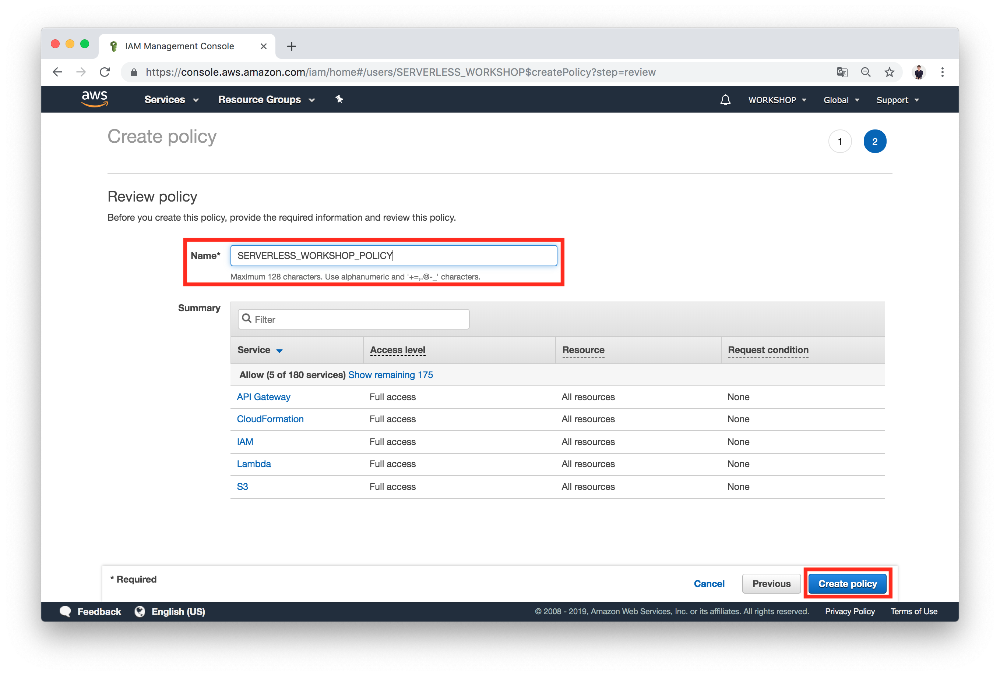


## (2) AWS CLI로 내 컴퓨터에 IAM 사용자 등록하기
> 아직 AWS CLI를 설치하지 않으셨나요? 핸즈온 진행을 위해서는 AWS CLI가 꼭 필요합니다. 아래 링크를 통해 AWS CLI를 컴퓨터에 설치해주세요.
- [AWS CLI 설치하기](https://aws.amazon.com/ko/cli/)
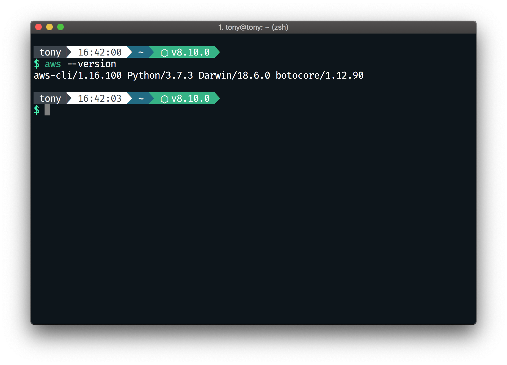

- 아래 명령어를 CLI에 입력합니다

  ```bash
  $ aws configure --profile SERVERLESS_WORKSHOP
  ```
  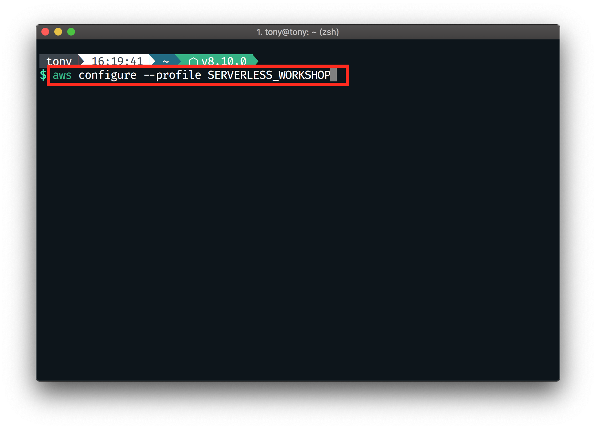

- `AWS Access Key ID`와 `Secret Access Key`, `Default region name`을 넣을 수 있는 란이 나오면, 아까 적어두었던 문자열과 `ap-northeast-2`를 붙여넣어줍니다. (`ap-northeast-2`는 AWS 서울 리전을 의미합니다)
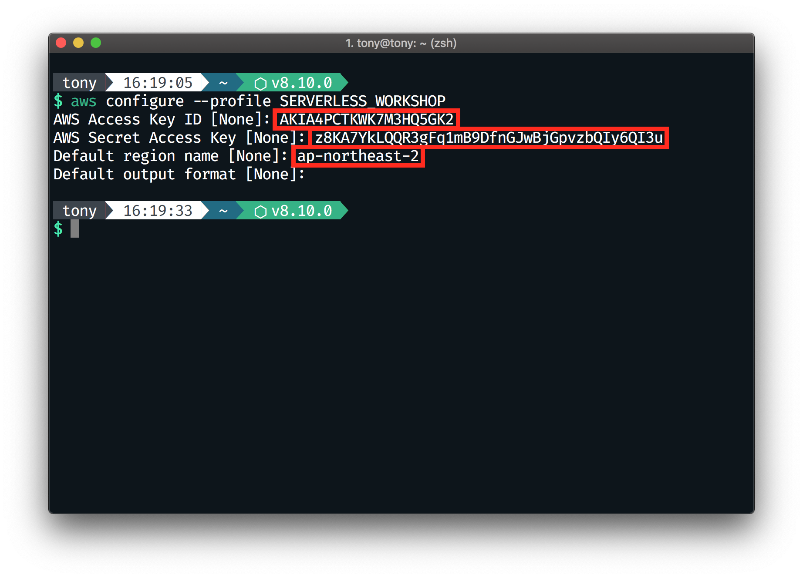

> 주입한 설정 내역은 `~/.aws/credentials`에 저장됩니다.


## (3) Serverless Framework을 사용해 Node.js 프로젝트 배포하기
Serverless Framework은 IaC(Insfrastructure as Code)의 일종으로, 코드를 통해 원하는 Serverless 환경을 깔끔하게 구성 할 수 있습니다. Serverless Framework은 `serverless.yml` 설정 파일을 기반으로 구동됩니다.

### 아키텍쳐

우리는 Node.js로 구성된 API를 아래의 아키텍쳐로 배포 할 것입니다.

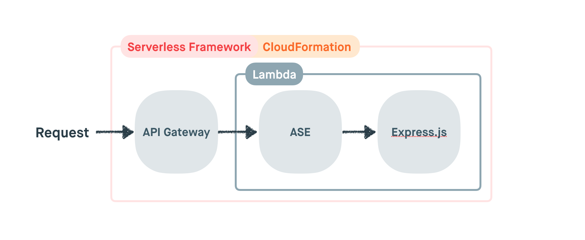

해당 아키텍쳐는 이미 `/starters/server/serverless.yml`에 구성되어 있습니다. 함께 살펴볼까요?

#### serverless.yml
```yaml
service: serverless-graphql-workshop

provider:
  name: aws
  runtime: nodejs8.10
  stage: ${opt:stage, 'dev'}
  region: ap-northeast-2
  profile: SERVERLESS_WORKSHOP

package:
  individually: true
  excludeDevDependencies: false

functions:
  main:
    name: ${self:service}-${self:provider.stage}
    handler: dist/serverless.handler
    memorySize: 1024
    timeout: 10
    environment:
      NODE_ENV: production
    package:
      include:
        - dist/serverless.js
      exclude:
        - '**'
    events:
      - http:
          path: /
          method: any
      - http:
          path: /{proxy+}
          method: any

plugins:
  - serverless-apigw-binary
  - serverless-dotenv-plugin

custom:
  apigwBinary:
    types:
      - '*/*'
```

`functions` 속성에서 해당 함수의 위치와 Route를 설정해주면 Serverless Framework이 자동으로 API Gateway와 Lambda를 설정합니다.

또한, `serverless-dotenv-plugin`을 통해, 현재 프로젝트 폴더의 `.env.development`, `.env.production`에 기입된 환경 변수들을 Lambda 내 환경에 추가해줍니다.

한번 배포해볼까요?

### 배포
아래의 스크립트를 `/starters/server` 내에서 실행합니다.

```bash
# TypeScript 프로젝트를 JavaScript로 빌드
$ yarn build

# 배포
$ yarn deploy:dev
```

잠시 기다리면, 배포가 완료된 모습을 확인 할 수 있습니다.


## 학습 목표 확인하기
- [x] IAM에 대해 이해한다
- [x] API Gateway와 Lambda를 통한 서버리스 API 배포에 대해 이해한다
- [x] `aws-serverless-express`를 사용해, Node.js 앱을 Lambda에 배포한다


## 다음으로 이동
1. **GraphQL 살펴보기** ✔
    1. GraphQL이란?
    2. GraphQL Type 시스템과 `Query`, `Mutation` Type
    3. Nexus로 시작하는 *Code-First* GraphQL 개발
    4. GraphQL Playground
    5. `Task` 타입과 쿼리, 뮤테이션 만들기
2. **Serverless로 GraphQL API 배포하기** ✔
    1. IAM 사용자 생성하기
    2. Serverless Framework을 사용해 Node.js 프로젝트 배포하기
3. **👉 [AWS에 Prisma 배포하기 (CloudFormation)](/documents/3-prisma-on-aws)**
4. Prisma 사용하기
    1. Prisma란?
    2. Prisma 시작하기
    3. Prisma Client 사용해보기
    4. `nexus-prisma`를 사용해, Prisma 연결하기
5. React.js에서 GraphQL 사용하기
6. 삭제하기
    1. API 배포 삭제하기
    2. CloudFormation Stack 삭제하기
