# 3. AWS에 Prisma 배포하기 (CloudFormation)

### 본 챕터의 학습 목표는 아래와 같습니다. 👏
- [ ] Prisma를 AWS 상에 띄운다

## Prisma Server를 띄우는 데 필요한 AWS 자원들
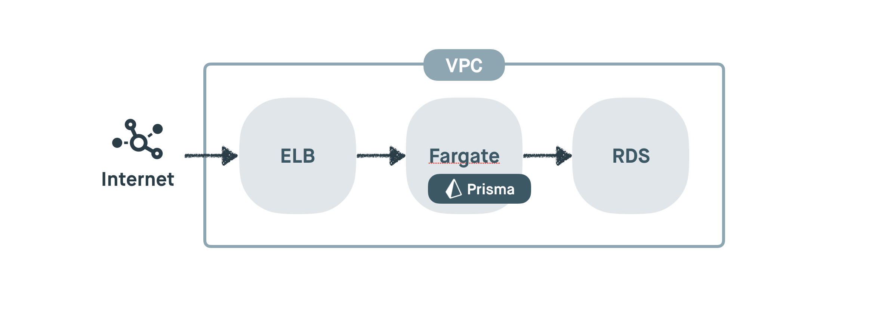
Prisma를 AWS 위에서 사용하기 위해서는

- VPC 등 네트워크 관련 설정
- Load Balancer (ELB)
- Prisma Server (Fargate)
- RDBMS (RDS)

를 AWS 환경에 설정해야 합니다. 만약 이 모든 작업을 모두 자동으로 해주는 도구가 있다면 어떨까요?

## CloudFormation 템플릿으로 Prisma를 AWS에 배포하기
CloudFormation 역시 Serverless Framework과 같은 IaC의 일종입니다. CloudFormation은 AWS에서 제공하는 기본 IaC로, AWS 내 모든 자원들을 한번에 배포하거나 수정, 삭제 할 수 있습니다.

자, 그럼 CloudFormation을 통해 쉽게 Prisma를 AWS에 배포해볼까요?

- 둘 중에 원하는 템플릿을 다운로드 받습니다.
  - MySQL 템플릿 [다운로드](https://raw.githubusercontent.com/tonyfromundefined/serverless-graphql-workshop/master/templates/prisma.mysql.yml)
  - Aurora Serverless 템플릿 [다운로드](https://raw.githubusercontent.com/tonyfromundefined/serverless-graphql-workshop/master/templates/prisma.aurora.serverless.yml)

> 다음 템플릿에 포함된 Fargate 서비스는 과금됩니다. 💰 [요금표](https://aws.amazon.com/ko/fargate/pricing/)

> [Aurora](https://aws.amazon.com/ko/rds/aurora/)는 AWS에서 만든 MySQL 호환 RDBMS입니다. [Aurora Serverless](https://aws.amazon.com/ko/rds/aurora/serverless/)를 사용하게 되면 인스턴스 관리가 필요없는 DB를 사용 할 수 있습니다. (Aurora Serverless는 프리티어가 제공되지 않으므로 과금됩니다 💰 [요금표](https://aws.amazon.com/ko/rds/aurora/serverless/))

- [AWS Console](https://console.aws.amazon.com)에 로그인 후 `Find Services`에서 `CloudFormation`을 검색, 클릭합니다.
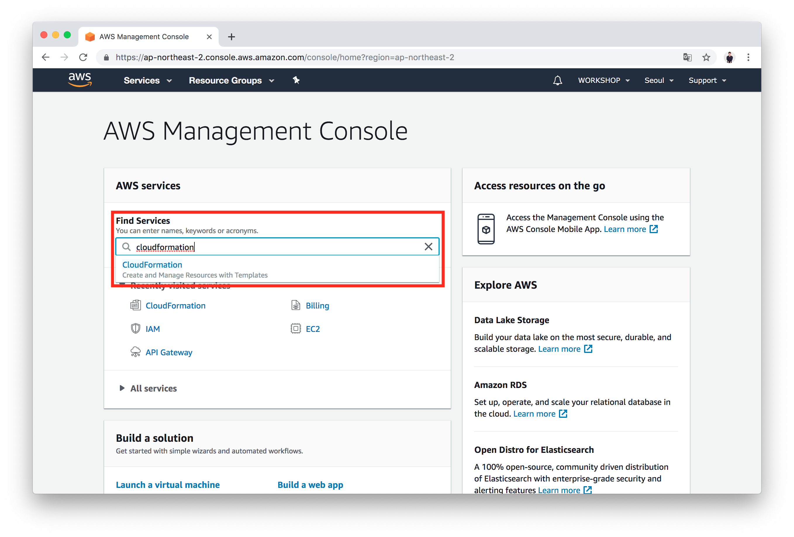

- `Create stack`을 클릭합니다.
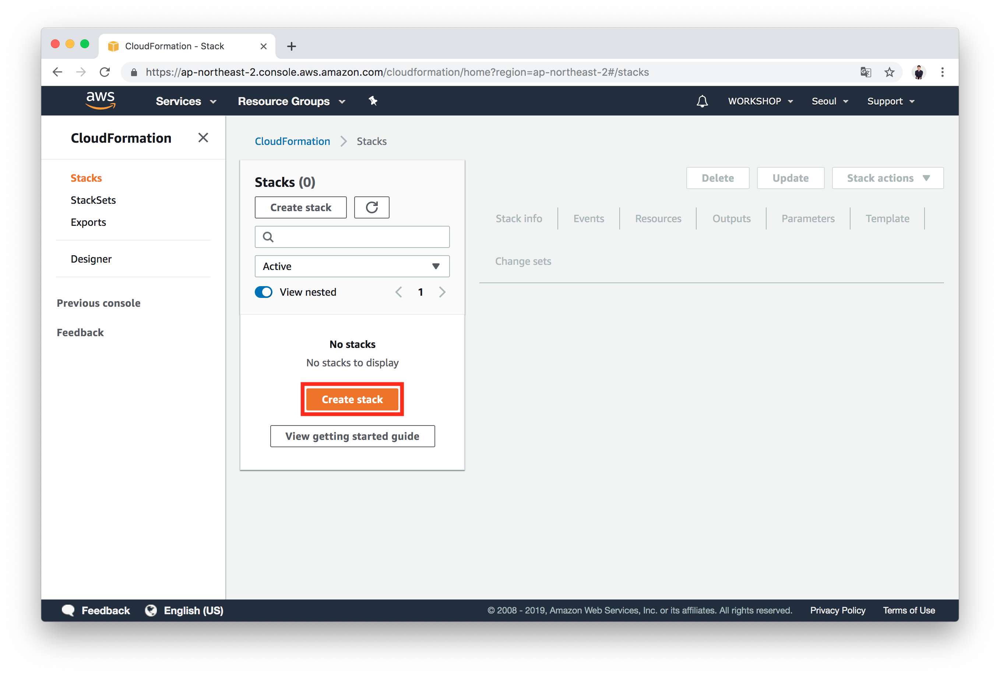

- `Upload a template file`을 선택 한 뒤, `Choose file`을 클릭해 다운로드 한 CloudFormation 템플릿 파일을 선택합니다.
- `Next`를 클릭합니다.
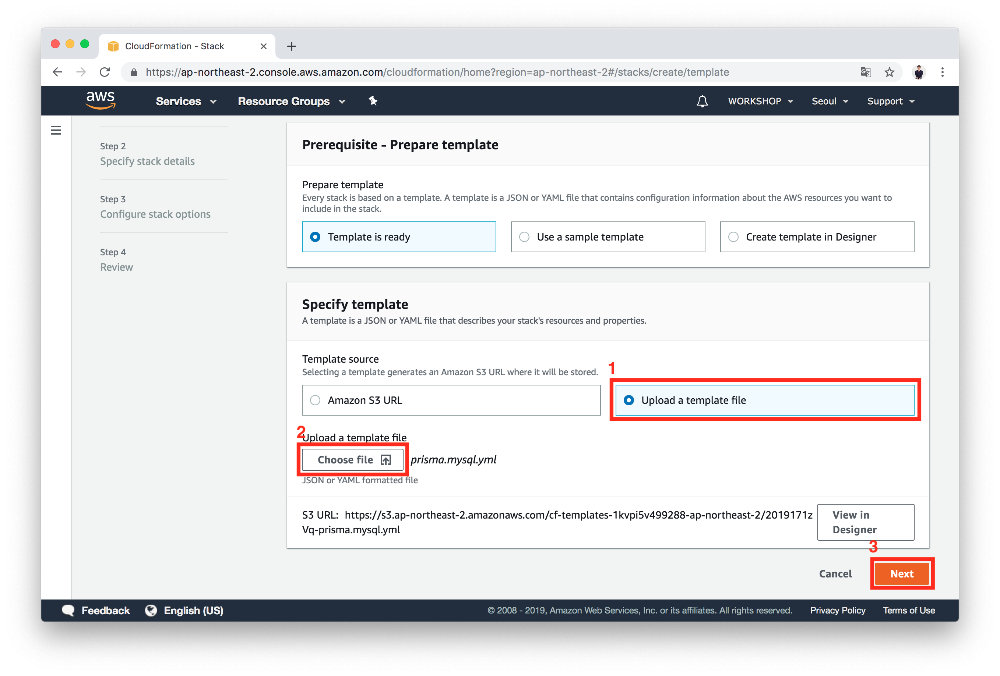

- `Stack name`에 `Prisma`를 적어줍니다.
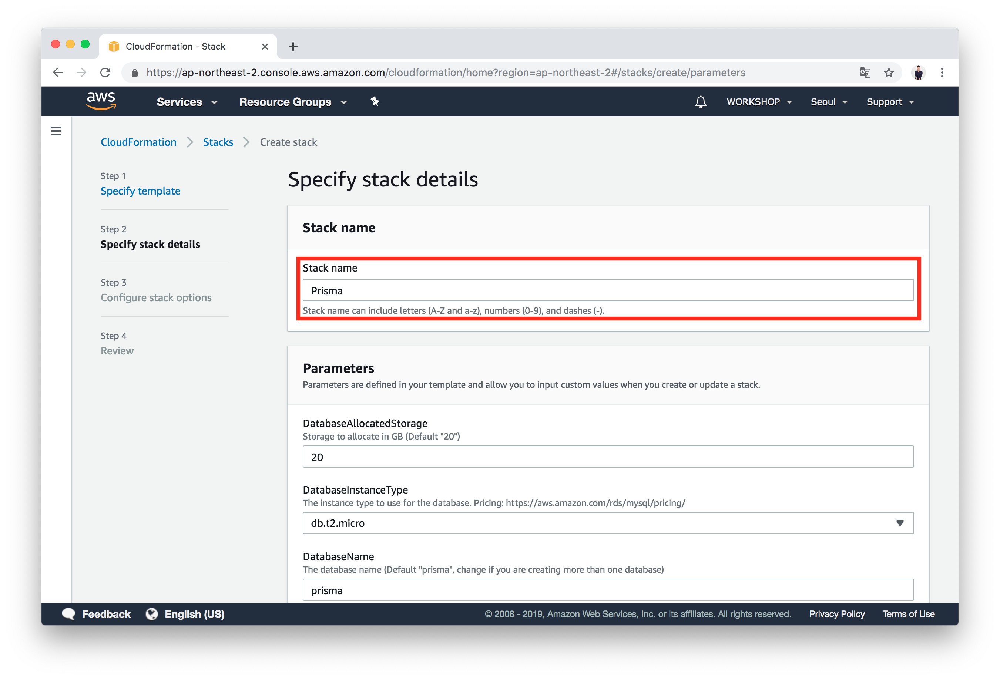

- `DatabaseName`에 `prisma`를 적어줍니다.
- `DatabasePassword`에 원하는 무작위 비밀번호를 적어줍니다.
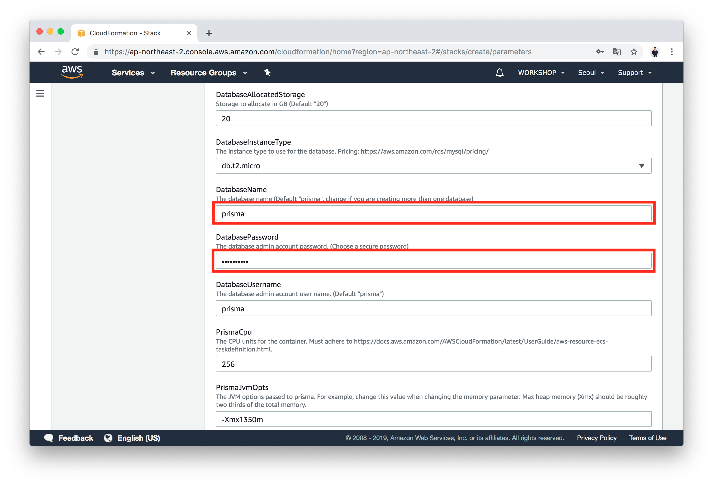

- `PrismaManagementApiSecret`에 원하는 비밀번호를 적은 뒤에 **안전한** 메모장에 옮겨 적어 놓습니다.
- `Next`를 클릭합니다.
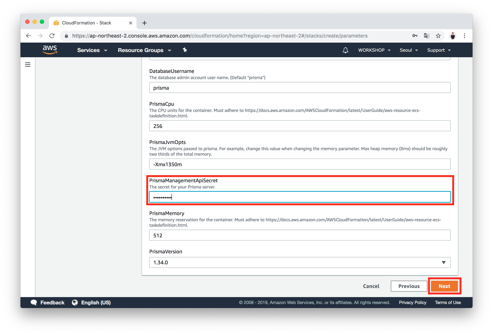

- 아래로 스크롤을 내려, 한번 더 `Next`를 클릭합니다.
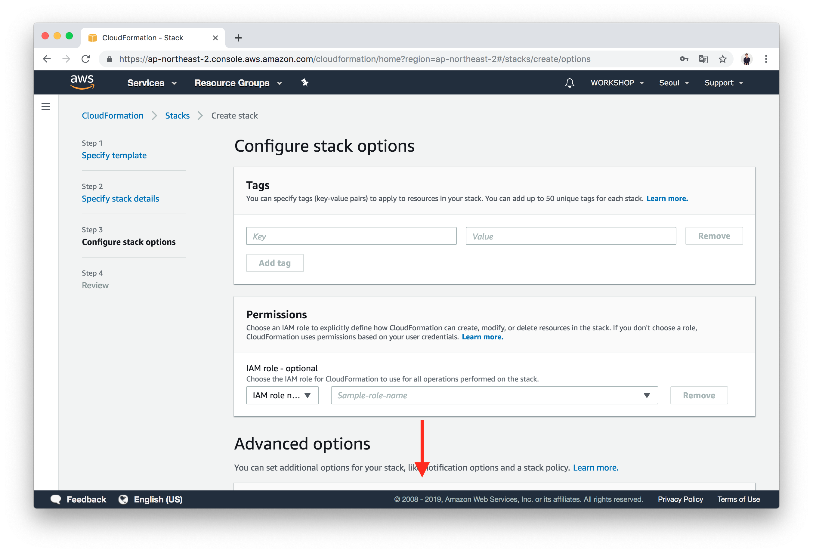
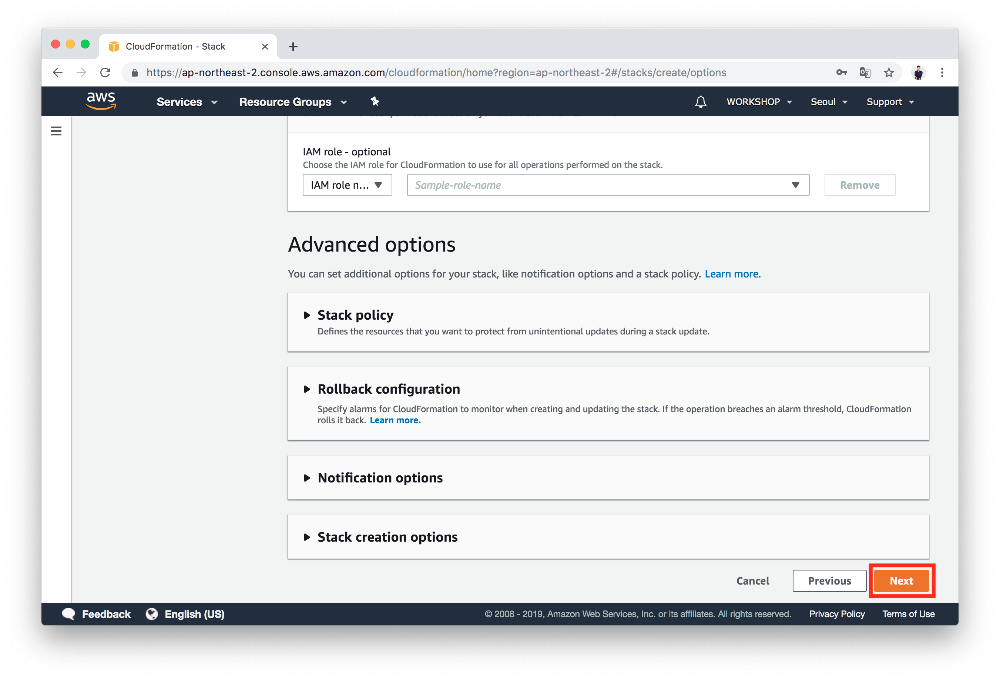

- 작성한 내용을 검토합니다.
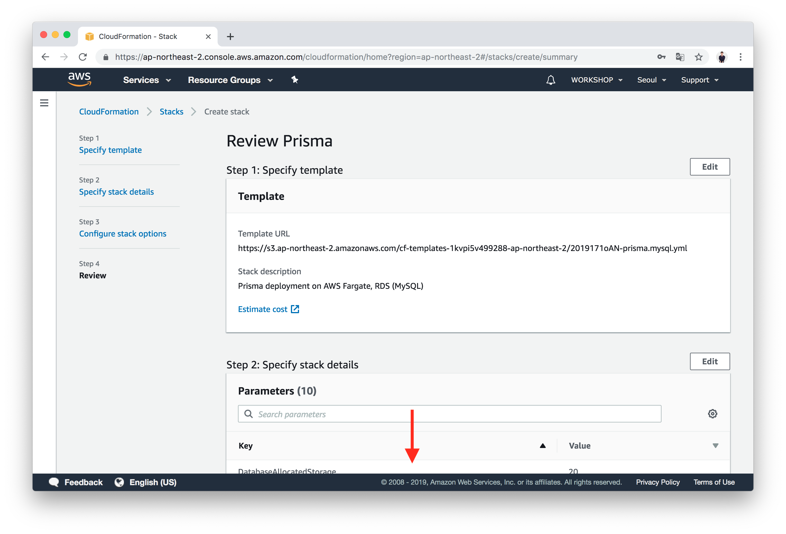

- 아래로 스크롤을 내려, `I acknowledge that AWS CloudFormation might create IAM resouces`에 체크 한 뒤, `Create stack`을 클릭합니다.

- 스택 생성을 진행합니다.
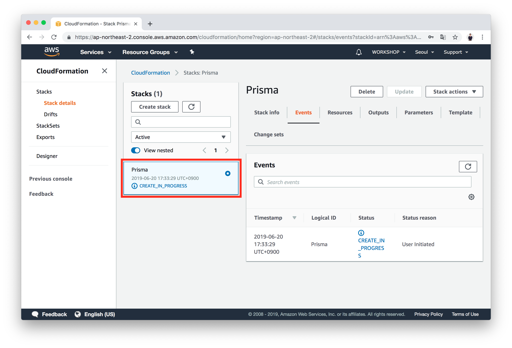

- 스택 생성이 완료되면, `Outputs` 탭에서 Prisma Endpoint를 확인 할 수 있습니다.

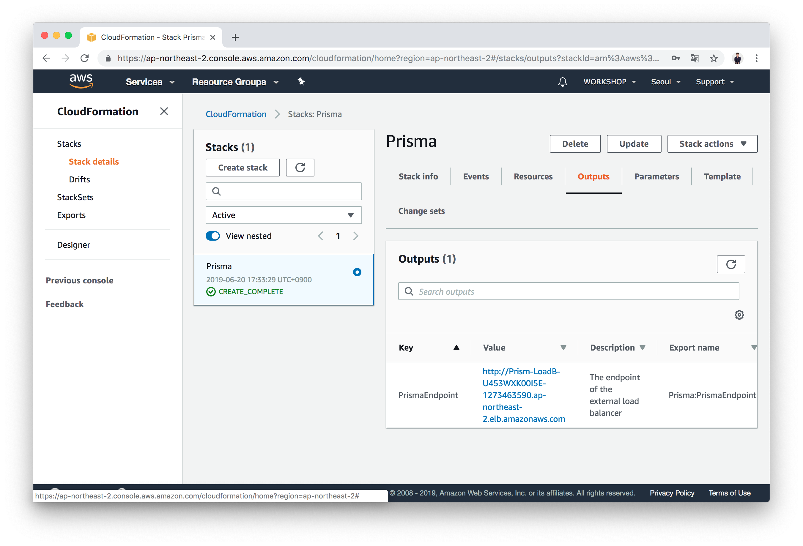

- 웹브라우저에서 생성된 Prisma Endpoint으로 접속해보면, 빈 GraphQL Playground를 확인 할 수 있습니다.
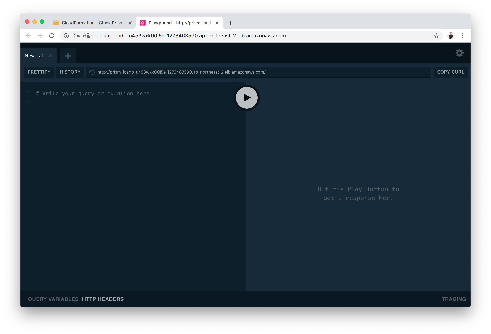

## 학습 목표 확인하기
- [x] Prisma를 AWS 상에 띄운다

## 다음으로 이동
1. **GraphQL 살펴보기** ✔
    1. GraphQL이란?
    2. GraphQL Type 시스템과 `Query`, `Mutation` Type
    3. Nexus로 시작하는 *Code-First* GraphQL 개발
    4. GraphQL Playground
    5. `Task` 타입과 쿼리, 뮤테이션 만들기
2. **Serverless로 GraphQL API 배포하기** ✔
    1. IAM 사용자 생성하기
    2. Serverless Framework을 사용해 Node.js 프로젝트 배포하기
3. **AWS에 Prisma 배포하기 (CloudFormation)** ✔
4. **👉 [Prisma 사용하기](/documents/4-prisma)**
    1. Prisma란?
    2. Prisma 시작하기
    3. Prisma Client 사용해보기
    4. `nexus-prisma`를 사용해, Prisma 연결하기
5. React.js에서 GraphQL API 사용하기
6. 삭제하기
    1. API 배포 삭제하기
    2. CloudFormation Stack 삭제하기
