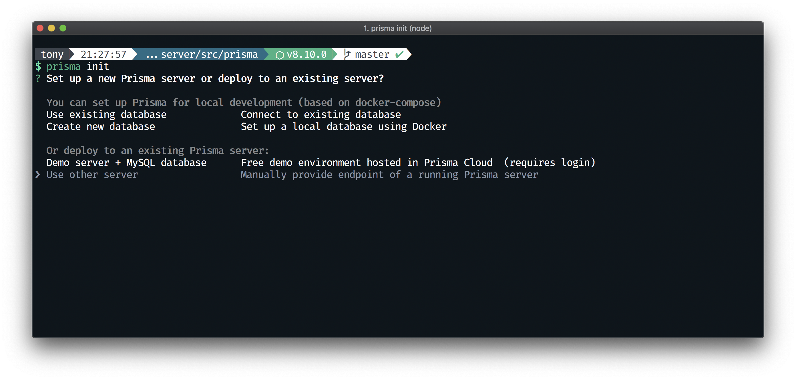
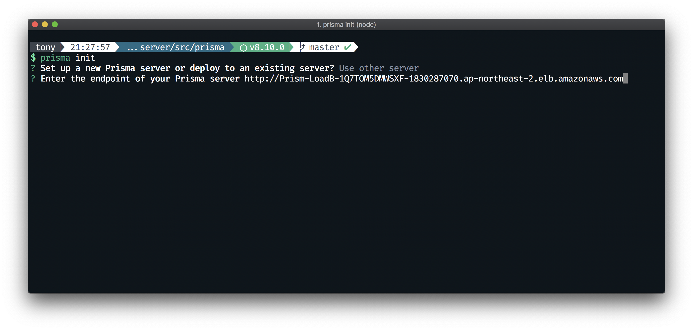
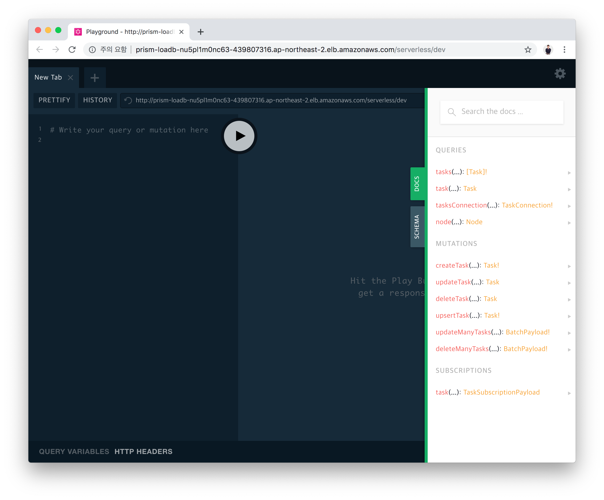

# 5. Prisma 사용하기

### 본 챕터의 학습 목표는 아래와 같습니다. 👏
- [ ] Prisma에 대해 이해한다
- [ ] Prisma CLI를 설치하고, Migration(`prisma deploy`)를 수행해본다
- [ ] Prisma Client를 사용해본다
- [ ] Nexus Prisma를 사용해본다


## (1) Prisma란?

### 출발
Prisma는 *Graphcool*이라는 서비스로부터 시작되었습니다.

#### Graphcool


*Graphcool*은 GraphQL 기반 오픈소스 BaaS(Backend as a service)로, 프론트엔드 개발자들이 더 쉽게 백엔드를 개발 할 수 있도록 도와주는 서비스입니다. GraphQL SDL(Schema Definition Language) 기반으로 데이터 모델을 구축하면 *Graphcool*이 이를 인식, CRUD(Create, Read, Update, Delete) GraphQL API를 생성해주는 서비스입니다. Prisma는 해당 서비스를 2년간 운영하면서 **몇가지 문제**를 만났습니다.

- *Graphcool*은 사용하기 쉽기 때문에 큰 사랑을 받았습니다. 개발자는 빠른 프로토타이핑을 위해 이 도구를 적극적으로 사용했지만, 실제 프로덕션 환경에서 자체 GraphQL 서버를 구축 할 때는 이 도구를 사용하기 힘들었습니다.
- 백엔드 개발자는 보다 많은 제어와 유연성을 원했습니다. 예를 들면 다음과 같습니다.
  - API 계층에서 데이터베이스 분리
  - 자신만의 도메인 중심 GraphQL 스키마 정의 (일반적인 CRUD 대신)
  - 프로그래밍 언어, 프레임 워크, 테스트 및 CI/CD 도구 선택 시 유연성 제공

#### Prisma 1.0 + Prisma Bindings

이를 해결하기 위해, *Graphcool*의 *Query Engine* 컴포넌트를 가지고 *Prisma bindings*라는 새로운 서비스를 출시하게 되었습니다. 이를 통해, Prisma가 SDL(Schema Definition Language)을 기반으로 자동으로 생성해준 GraphQL CRUD 쿼리/뮤테이션을 GraphQL API에 포함하여 빠르게 백엔드를 개발 할 수 있습니다.

또한 회사 브랜드 역시 *Graphcool*에서 *Prisma*로 완전히 전환하고, 앞으로 Prisma에 더 힘을 쓰게 됩니다.

#### Prisma Client

이에 더 나아가서, Prisma는 Prisma Client라는 신규 라이브러리를 통해 API 환경이 GraphQL이 아니더라도 ORM과 같이 Prisma를 사용 할 수 있게 하였습니다. GraphQL의 타입 시스템을 기반으로 만들어진 Type-Safe ORM은 백엔드 개발에 날개를 달아줍니다.

### Prisma를 통해 테이블과 CRUD 생성
일반적인 ORM과 비슷하게, SDL(Schema Definition Langauge)로 데이터 모델을 정의하면, Prisma는 해당 데이터 모델을 기반으로 RDBMS에 테이블을 생성하고, Prisma Server 내부에, 해당 데이터 모델에 대한 CRUD 쿼리/뮤테이션을 생성합니다.

#### `datamodel.prisma`
```graphql
type Task {
  id: ID!
  content: String!
  isDone: Boolean!
}
```

#### Bash
```bash
$ prisma deploy
```


## (2) Prisma 시작하기
자, 그럼 한번 Prisma를 사용해볼까요?

- Prisma CLI를 설치합니다.

  ```bash
  $ npm i -g prisma
  ```

- 프로젝트 폴더로 내에 `.env.development` 파일과 `.env.production` 파일을 수정해줍니다.
- 전에 배포한 Prisma의 엔드포인트를 넣어주세요.
  - 엔드포인트 뒤에 서비스 이름은 알맞게 지어주시고, stage는 각각 `dev`와 `prod`를 적어주세요. (`http://엔드포인트/서비스/스테이지`)
  - 예시: `http://prisma.ap-northeast-2.elb.amazonaws.com/serverless/dev`
- 마찬가지로 Prisma의 `managementApiSecret`을 넣어줍니다.

  #### `.env.development`
  ```
  STAGE="development"
  IS_PLAYGROUND_ENABLED="1"

  PRISMA_ENDPOINT="http://prisma.ap-northeast-2.elb.amazonaws.com/serverless/dev"
  PRISMA_MANAGEMENT_API_SECRET="serverless"
  ```

  #### `.env.production`
  ```
  STAGE="production"
  IS_PLAYGROUND_ENABLED="0"

  PRISMA_ENDPOINT="http://prisma.ap-northeast-2.elb.amazonaws.com/serverless/prod"
  PRISMA_MANAGEMENT_API_SECRET="serverless"
  ```

- CLI에서 다음과 같이 입력합니다.

  ```bash
  yarn prisma:migrate:dev
  ```
  

- Prisma가 RDBMS에 해당 데이터 모델과 일치하는 테이블을 생성했습니다.


- CLI 결과로 출력된 엔드포인트 링크로 들어가면, CRUD 쿼리/뮤테이션이 생성된 모습을 확인 할 수 있습니다.


- 또, CLI 결과로 출력된 Dashboard 링크로 들어가면, 데이터를 생성, 수정, 삭제 할 수 있는 대시보드를 확인 할 수 있습니다.
  

  - CLI에 다음 명령어를 입력하면 대시보드로 바로 이동 할 수 있습니다.

    ```bash
    $ yarn prisma:admin:dev
    ```


## (3) Prisma Client 사용해보기
아까 만든 `task` schema를 Prisma Client를 사용해 구현해볼까요?

#### `/src/schema/task/Query.ts`
```typescript
import { extendType, idArg } from 'nexus'
import { prisma } from '~/generated/prisma'

export const TaskQueries = extendType({
  type: 'Query',
  definition(t) {
    t.field('task', {
      type: 'Task',
      args: {
        id: idArg({
          required: true,
        }),
      },
      resolve: async (_parent, args) => {
        const task = await prisma.task({
          id: args.id,
        })

        if (task) {
          return task

        } else {
          throw new Error(`${args.id}를 가진 Task를 찾을 수 없습니다`)
        }
      },
    })

    t.list.field('tasks', {
      type: 'Task',
      resolve: () => {
        return prisma.tasks()
      },
    })
  },
})
```

#### `/src/schema/task/Mutation.ts`
```typescript
import { booleanArg, extendType, idArg, stringArg } from 'nexus'
import { prisma } from '~/generated/prisma'

export const TaskMutations = extendType({
  type: 'Mutation',
  definition(t) {
    t.field('createTask', {
      type: 'Task',
      args: {
        content: stringArg({
          required: true,
        }),
      },
      resolve: (_parent, args) => {
        return prisma.createTask({
          content: args.content,
          isDone: false,
        })
      },
    })

    t.field('updateTask', {
      type: 'Task',
      args: {
        id: idArg({
          required: true,
        }),
        content: stringArg(),
        isDone: booleanArg(),
      },
      resolve: (_parent, args) => {
        return prisma.updateTask({
          data: {
            content: args.content,
            isDone: args.isDone,
          },
          where: {
            id: args.id,
          },
        })
      },
    })

    t.field('deleteTask', {
      type: 'Task',
      args: {
        id: idArg({
          required: true,
        }),
      },
      resolve: (_parent, args) => {
        return prisma.deleteTask({
          id: args.id,
        })
      },
    })
  },
})
```


## (4) Nexus Prisma 사용해, Prisma를 API에 연결하기
생각해보니, Task 타입과 CRUD GraphQL 쿼리/뮤테이션들을 Prisma가 이미 만들었었죠! Nexus Prisma를 사용해 자동으로 생성된 타입과 쿼리/뮤테이션을 그대로 이용해볼까요?

#### `/src/app.ts`
```

```


## 학습 목표 확인하기
- [x] Prisma에 대해 이해한다
- [x] Prisma CLI를 설치하고, Migration(`prisma deploy`)를 수행해본다
- [x] Prisma Client를 사용해본다
- [x] Nexus Prisma를 사용해본다


## 다음으로 이동
1. **GraphQL 살펴보기** ✔
    1. GraphQL이란?
    2. GraphQL Type 시스템과 `Query`, `Mutation` Type
    3. Nexus로 시작하는 *Code-First* GraphQL 개발
    4. GraphQL Playground
    5. `Task` 타입과 쿼리, 뮤테이션 만들기
2. **Serverless로 GraphQL API 배포하기** ✔
    1. IAM 사용자 생성하기
    2. Serverless Framework을 사용해 Node.js 프로젝트 배포하기
3. **AWS에 Prisma 배포하기 (CloudFormation)** ✔
4. **Prisma 사용하기** ✔
    1. Prisma란?
    2. Prisma 시작하기
    3. Prisma Client 사용해보기
    4. `nexus-prisma`를 사용해, Prisma 연결하기
5. **👉 [React.js에서 GraphQL API 사용하기](/documents/5-react-graphql/README.md)**
6. 삭제하기
    1. API 배포 삭제하기
    2. CloudFormation Stack 삭제하기
    3. IAM 사용자 삭제하기

---

### References
- [How Prisma and GraphQL fit together](https://www.prisma.io/blog/prisma-and-graphql-mfl5y2r7t49c/)
