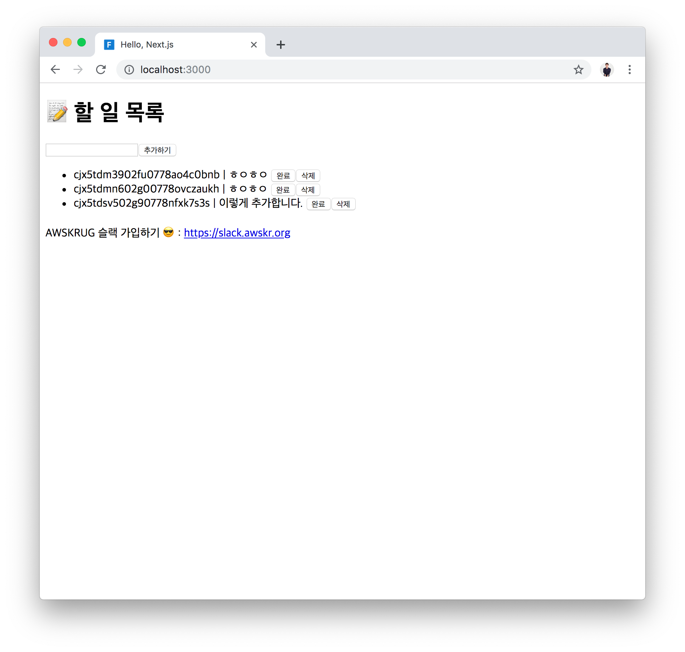

# 5. React.js에서 GraphQL API 사용하기

### 본 챕터의 학습 목표는 아래와 같습니다. 👏
- [ ] GraphQL Code Generator로 React 코드를 생성하여 사용해본다.
- [ ] End-to-end Typing 개념에 대해 이해한다.


## React 클라이언트 프로젝트 시작하기
이제 만든 API를 웹 클라이언트에서 사용해볼까요? 클라이언트 프로젝트로 이동해보겠습니다. 해당 프로젝트는 본 레포 안의 `/starters/client` 폴더 안에서 찾을 수 있습니다.

### 폴더 및 파일 구조 살펴보기
> 본 워크숍에서는 클라이언트 기술에 대해 깊게 공부하지 않습니다. 따라서 클라이언트 프로젝트 구조는 따로 설명하지 않습니다.

### 시작하기
- `/starters/client/` 폴더로 이동합니다.

  ```bash
  $ cd ./starters/client
  ```

- 프로젝트에 필요한 라이브러리를 설치합니다.

  ```bash
  # 기존에 yarn이 설치되어 있지 않다면,
  $ npm i -g yarn

  # 라이브러리 설치하기
  $ yarn
  ```

  > 해당 작업이 완료되면 `node_modules` 폴더가 생성되고 해당 폴더 아래에 필요한 라이브러리들이 위치하게 됩니다.

- 프로젝트 폴더에 아래 두 파일을 생성합니다.
- `NEXT_APP_GRAPHQL_ENDPOINT`에 우리가 배포한 GraphQL API 엔드포인트를 넣어줍니다.
  - `.env.development`
    
    ```
    NEXT_APP_STAGE = "development"
    NEXT_APP_GRAPHQL_ENDPOINT = "https://fyeitajxaa.execute-api.ap-northeast-2.amazonaws.com/dev/graphql"
    NEXT_APP_VERSION = "0.0.1"
    ```
  
  - `.env.production`
    
    ```
    NEXT_APP_STAGE = "production"
    NEXT_APP_GRAPHQL_ENDPOINT = "https://fyeitajxaa.execute-api.ap-northeast-2.amazonaws.com/dev/graphql"
    NEXT_APP_VERSION = "0.0.1"
    ```

  > 두 파일을 통해 각 스테이지에서 환경 변수를 설정 할 수 있습니다.

- 개발 서버 시작하기

  ```bash
  $ yarn dev
  ```
  > 개발 서버를 시작 한 뒤에는 `http://localhost:3000`로 접근 할 수 있습니다.

## GraphQL API 사용하기
### 사용 할 쿼리 만들기
- `/src/queries` 폴더를 만듭니다.
- 해당 폴더 내에 다음 네개의 파일을 만들어줍니다.

  #### `getTasks.graphql`
  ```graphql
  query getTasks {
    tasks {
      id
      content
      isDone
    }
  }
  ```

  #### `createTask.graphql`
  ```graphql
  mutation createTask($data: TaskCreateInput!) {
    createTask(data: $data) {
      id
    }
  }
  ```

  #### `updateTask.graphql`
  ```graphql
  mutation updateTask($data: TaskUpdateInput!, $where: TaskWhereUniqueInput!) {
    updateTask(data: $data, where: $where) {
      id
    }
  }
  ```

  #### `deleteTask.graphql`
  ```graphql
  mutation deleteTask($where: TaskWhereUniqueInput!) {
    deleteTask(where: $where) {
      id
    }
  }
  ```

- React 컴포넌트 내에서 사용할 함수를 생성해줍니다.

  ```bash
  $ yarn generate
  ```

### 쿼리 사용하기
- `/src/pages/index.tsx`를 수정해줍니다.

  ```tsx
  import { useState } from 'react'
  import {
    IGetTasksQuery,
    useCreateTaskMutation,
    useDeleteTaskMutation,
    useGetTasksQuery,
    useUpdateTaskMutation,
  } from '~/generated/graphql'

  export default function PageIndex() {
    const [content, setContent] = useState('')

    const { error, loading, data, refetch } = useGetTasksQuery()
    const createTask = useCreateTaskMutation()

    const onInputChange = (event: React.ChangeEvent<HTMLInputElement>) => {
      setContent(event.target.value)
    }

    const onAddButtonClick = async () => {
      await createTask({
        variables: {
          data: {
            content,
            isDone: false,
          },
        },
      })
      await refetch()
    }

    return (
      <div>
        <h1>📝 할 일 목록</h1>
        <div className='add'>
          <input type='text' value={content} onChange={onInputChange} />
          <button onClick={onAddButtonClick}>추가하기</button>
        </div>
        <Tasks
          error={error}
          loading={loading}
          data={data}
          refetch={refetch}
        />
        <div>
          AWSKRUG 슬랙 가입하기 😎: <a href='https://slack.awskr.org'>https://slack.awskr.org</a>
        </div>
      </div>
    )
  }

  interface ITasksProps {
    error: any
    loading: boolean
    data?: IGetTasksQuery
    refetch: () => any
  }
  function Tasks(props: ITasksProps) {
    const updateTask = useUpdateTaskMutation()
    const deleteTask = useDeleteTaskMutation()

    if (props.error) {
      return (
        <div>error</div>
      )
    }

    if (props.loading || !props.data || !props.data.tasks) {
      return (
        <div>loading...</div>
      )
    }

    return (
      <ul>
        {props.data.tasks.map((task) => {
          const onCompleteButtonClick = async () => {
            await updateTask({
              variables: {
                data: {
                  isDone: true,
                },
                where: {
                  id: task.id,
                },
              },
            })
            await props.refetch()
          }

          const onDeleteButtonClick = async () => {
            await deleteTask({
              variables: {
                where: {
                  id: task.id,
                },
              },
            })
            await props.refetch()
          }

          return (
            <li key={task.id}>
              <span>{task.id}</span>
              {'\u00A0'}|{'\u00A0'}
              <span>{task.content}</span>
              {task.isDone && <span>{'\u00A0'}✔</span>}
              {'\u00A0'}
              <button onClick={onCompleteButtonClick}>완료</button>
              <button onClick={onDeleteButtonClick}>삭제</button>
            </li>
          )
        })}
      </ul>
    )
  }
  ```

코드를 살펴보시면, TypeScript로 안전하게 타입이 지켜지는 모습을 확인 할 수 있습니다. 이렇게 GraphQL과 TypeScript를 사용하면, RDBMS 스키마부터 클라이언트 쿼리까지 모든 부분에서 엄격하게 타입 체킹을 확인 할 수 있고 이를 End-to-end Typing이라고 표현합니다.

이런식으로 Nexus와 GraphQL Code Generator를 사용하면, Prisma와 GraphQL, TypeScript의 타입 시스템을 자동으로 통합 할 수 있고, 이를 통해 우리는 제품 전 영역에 걸쳐 안전하게 타입을 지킬 수 있게 됩니다. 이는 제품을 더 안전하게 만들고 이에 더불어 IDE(통합 개발 환경)에서 지원하는 각종 편의 기능을 통해 더 빠르게 제품을 개발 할 수 있습니다.

## 완료 🥳
축하합니다!🎉 서버리스 GraphQL 핸즈온을 훌륭하게 마치셨습니다! Prisma를 올리는데 사용한 AWS Fargate는 과금됩니다. 미리 준비된 [삭제 가이드](/documents/6-delete/README.md)를 참고하여 집에 돌아가시기 전에 반드시 삭제해주세요.



## 학습 목표 확인하기
- [x] GraphQL Code Generator로 React 코드를 생성하여 사용해본다.
- [x] End-to-end Typing 개념에 대해 이해한다.


## 다음으로 이동
1. **GraphQL 살펴보기** ✔
    1. GraphQL이란?
    2. GraphQL Type 시스템과 `Query`, `Mutation` Type
    3. Nexus로 시작하는 *Code-First* GraphQL 개발
    4. GraphQL Playground
    5. `Task` 타입과 쿼리, 뮤테이션 만들기
2. **Serverless로 GraphQL API 배포하기** ✔
    1. IAM 사용자 생성하기
    2. Serverless Framework을 사용해 Node.js 프로젝트 배포하기
3. **AWS에 Prisma 배포하기 (CloudFormation)** ✔
4. **Prisma 사용하기** ✔
    1. Prisma란?
    2. Prisma 시작하기
    3. Prisma Client 사용해보기
    4. `nexus-prisma`를 사용해, Prisma 연결하기
5. **React.js에서 GraphQL API 사용하기** ✔
6. **[삭제하기](/documents/6-delete/README.md)**
    1. API 배포 삭제하기
    2. CloudFormation Stack 삭제하기
    3. IAM 사용자 삭제하기
