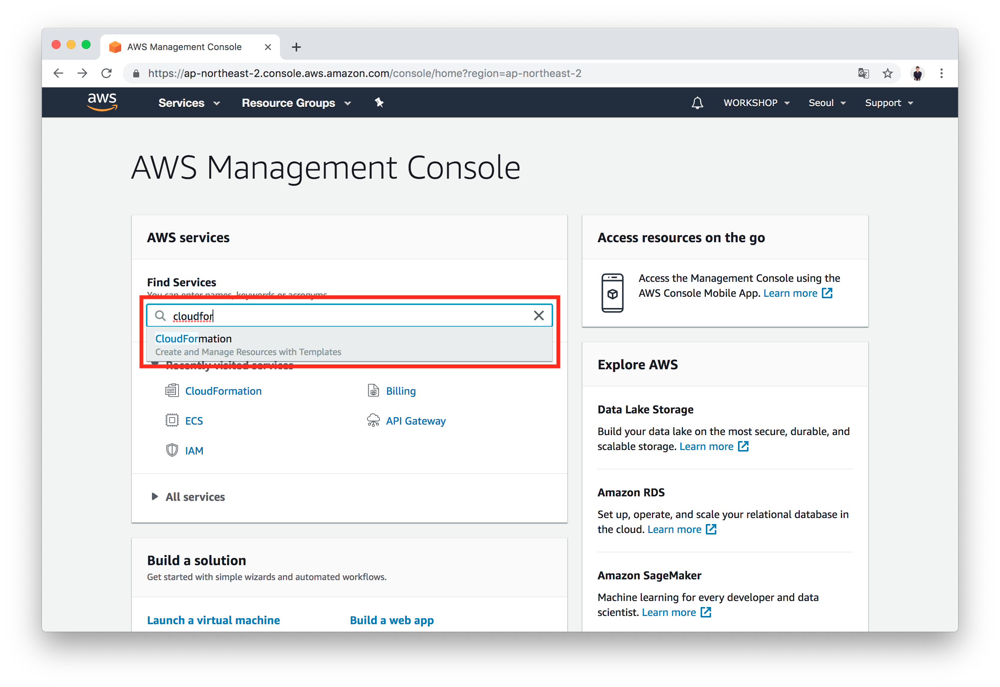
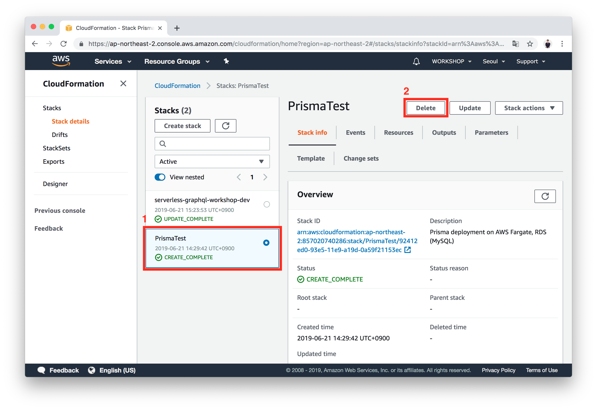
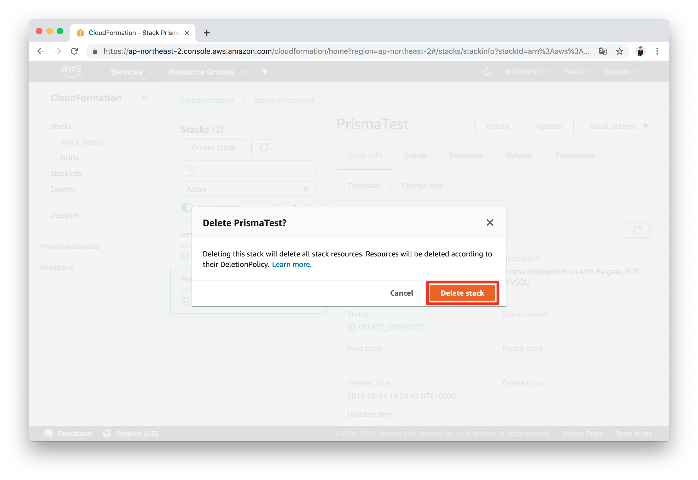
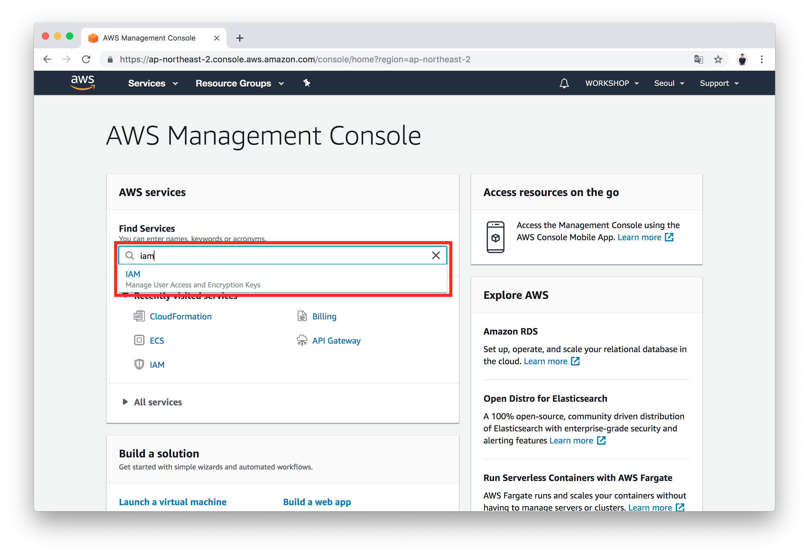
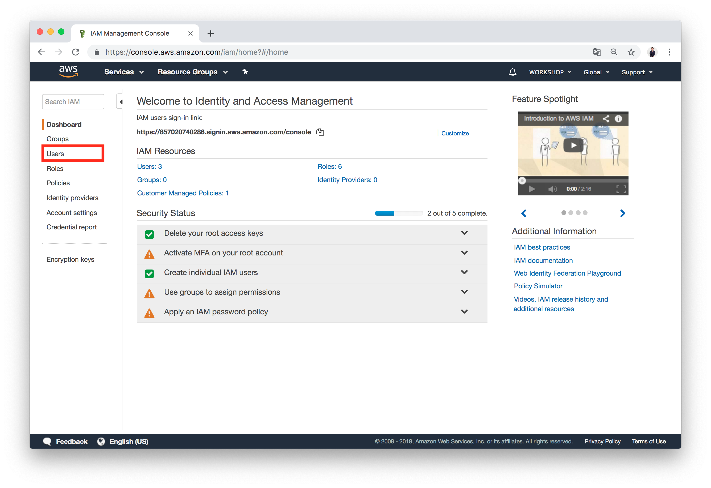
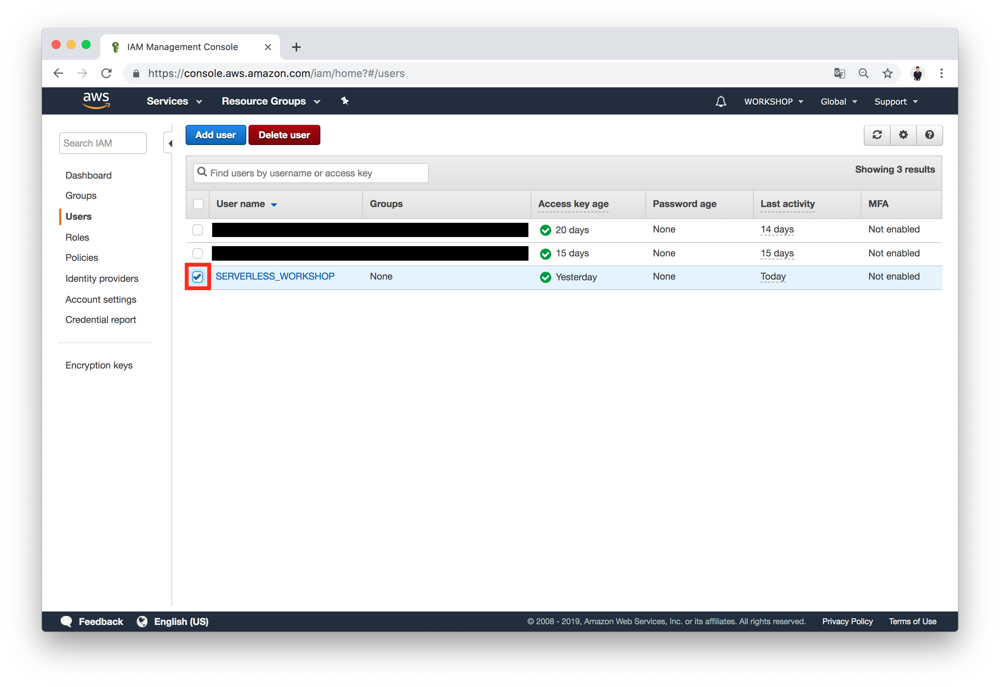
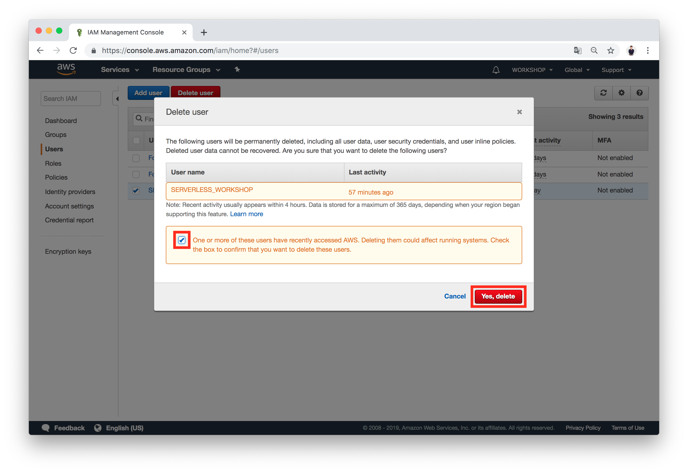

# 7. 삭제하기

## (1) API 배포 삭제하기
- `/starters/server/` 폴더로 이동합니다.

  ```bash
  $ cd ./starters/server
  ```

- 다음 스크립트를 CLI에 입력합니다.

  ```bash
  $ yarn undeploy:dev
  ```

## (2) CloudFormation Stack 삭제하기
- [AWS Console](https://console.aws.amazon.com)에 로그인 후 `Find Services`에서 `CloudFormation`을 검색, 클릭합니다.
  

- 챕터 3에서 생성한 CloudFormation 스택을 선택 한 뒤 `DELETE` 버튼을 클릭합니다.
  

- `Delete stack`을 클릭합니다.
  

## (3) IAM 사용자 삭제하기
- [AWS Console](https://console.aws.amazon.com)에 로그인 후 `Find Services`에서 `IAM`을 검색, 클릭합니다.
  

- `Users` 메뉴로 이동합니다
  

- 전에 생성한 `SERVERLESS_WORKSHOP`을 선택 한 뒤, `Delete user`를 클릭합니다.
  

- `One or more...`를 선택 한 뒤, `Yes, delete`를 클릭합니다.
  
